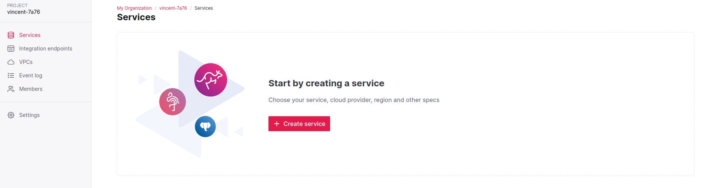
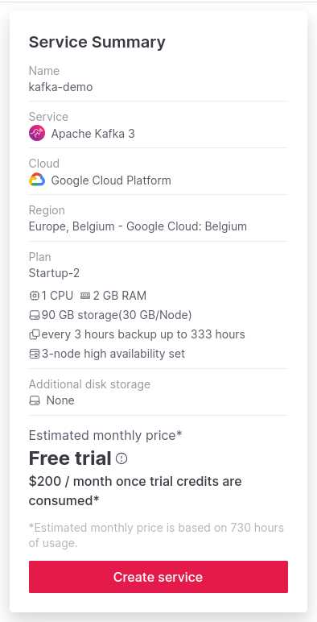
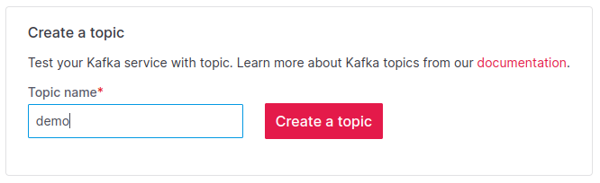
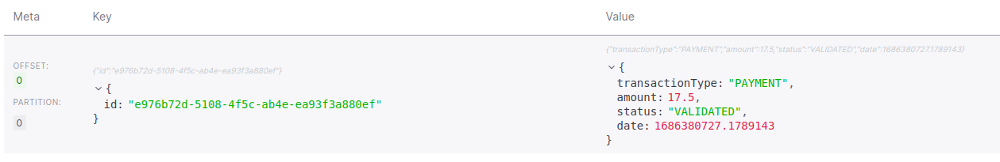
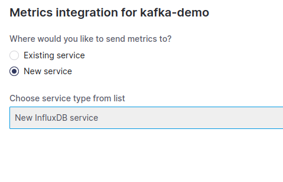
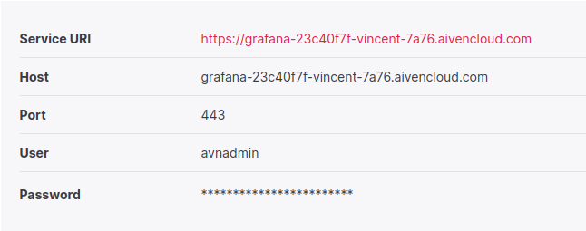
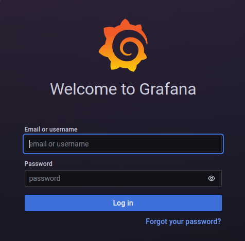
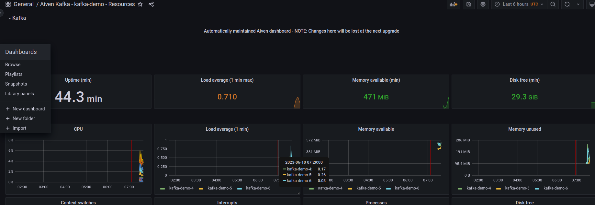

# Aiven Kafka Quickstart with Python client and monitoring

This article is a quickstart guide that will help you start using Aiven Kafka and use it with a Python client.

## Objectives

By the end of this tutorial, you will be able to:
* Create a kafka cluster using Aiven console
* Connect and publish message with a python client
* Monitor basics metrics of your cluster

## Prerequisites
To follow this tutorial, it is mandatory to :
* Have access to an Aiven account and project, you can [get a free trial here](https://console.aiven.io/signup).
* Have basic understanding of Kafka concepts

## Setting up the cluster

To create your first Aiven kafka cluster using the web console, start by going to your Aiven project home page at https://console.aiven.io/



From here you can click on create service, then select Apache Kafka.

In the next page, you can select the cloud provider in which the cluster will be created, for this tutorial I will go with Google Cloud but you can choose any.

Then you can choose the region within the provider, I go with europe-west1, but here again you can choose any location, preferably one that is close to you.

And finally you can choose the plan. 
Setting the correct plan based on your needs is not in the scope of this tutorial, just note that plan will directly impact your cluster performance and availability capacities. I'll go with the cheaper one, startup-4 which is more than enough for this.

At the end of the service configuration, the summary should look like this :



And you can click create.

> Important : once you click on create service, you will be billed based on the time the service is running. If you are following this tutorial with the free trial, you get 300$. Otherwise, **you could be billed** from now.

On the next page, the console lets you download CA Certificate, Access Certificate and Access Key, you will need them to connect to your cluster.

Once you downloaded them, you can click on Next: Create Topic.



Here you can choose any topic name and click create.

You can then skip the rest of the console tutorial as this guide will do it step by step with you.

## Start streaming data

After a few seconds, your Aiven kafka cluster should be in a running state, you can now start sending data.

This guide provides a quick_start.py script that is an example of script producing data to a kafka topic, it should almost work out of the box.

### Authentification

The first few lines are used for authentication to the kafka cluster. We use the CA and key files that we downloaded earlier, they should be present in the working directory of the script for this to work.

The SERVER constant is the server URI displayed in your aiven console.

``` python
producer = KafkaProducer(
    bootstrap_servers=SERVER,
    security_protocol="SSL",
    ssl_cafile="ca.pem",
    ssl_certfile="service.cert",
    ssl_keyfile="service.key",
)
```

This is a basic authentication method, you can get [more information about authentication here](https://docs.aiven.io/docs/products/kafka/concepts/auth-types).

### Sending data

```python
message = {
    'transactionType': 'PAYMENT',
    'amount': 17.5,
    'status': 'VALIDATED',
    'date': time.time()
}

producer.send(TOPIC_NAME, json.dumps(message).encode('utf-8'),
              json.dumps({'id': str(uuid.uuid4())}).encode('utf-8'))
```
This code is generating an example of an event (here a payment status is validated) and sending it to the topic with a timestamp as id.

Then you will be able to read the message from the topic.

You can also see the message in the Aiven console :



## Monitoring you cluster

Once you are able to create a kafka cluster and start producing and consuming messages, you probably want to monitor your cluster.

Aiven provides out of the box tools to gather cluster metrics and use them, here we will show one way to do that.

### Send metrics to InfluxDB

InfluxDB is a time series database that is well suited for storing metrics. Here we will use it to store monitoring metrics from the kafka cluster.

To do that, you first need to  go to the integration tab of your service in the Aiven console, then click on Store metrics from the Aiven solution and then create a new instance of InfluxDB. (Cloud provider and plan choices are the same as the kafka cluster).



As influxDB is a managed service provided by Aiven, you don't need to configure anything else, your metrics are already sent to the database. You will also be billed for this instance.

InfluxDB is only a database, so if you want to use these metrics you'll need an observability tool. Fortunately, Aiven also provides a managed tool for that !

### Dashboarding with Grafana

Go back to your new instance of influxDB, and in integration select Grafana Metrics Dashboard.

Configuration is also done for you so Grafana is already able to read metrics from the influxDB service that we created, and is provided with a default dashboard to monitor kafka !

Once the service is up and running you can access the Grafana URL from the service overview where you can also find user/password for the console.




To start monitoring your Kafka cluster, you can browse dashboards in grafana, then, in the General folder click on the dashboard corresponding to your cluster.



You can get [more information on Kafka cluster monitoring](https://www.datadoghq.com/blog/monitoring-kafka-performance-metrics/) from
this article from datadog.

## Conclusion

Thank you for your interest in Aiven Kafka managed solution, I hope this article helped you.

We saw together how easy it is to use Aiven managed services and integrate them together.

You are now able to create kafka clusters, use them to produce and consume messages, and monitor the health of your cluster !

Please note that this is only a quickstart guide and your infrastructure is not production ready.

Here is a list of topics you can explore now :

* We didn't talk about [kafka consumer and especially consumer group](https://docs.confluent.io/platform/current/clients/consumer.html), this is a very important topic when creating your application.
* We also used the cheaper Aiven plan here, this is usually not want you want for production as it affects Availability, you can [dive deeper in plan here](https://aiven.io/kafka-plan-finder?tab=plan-pricing)